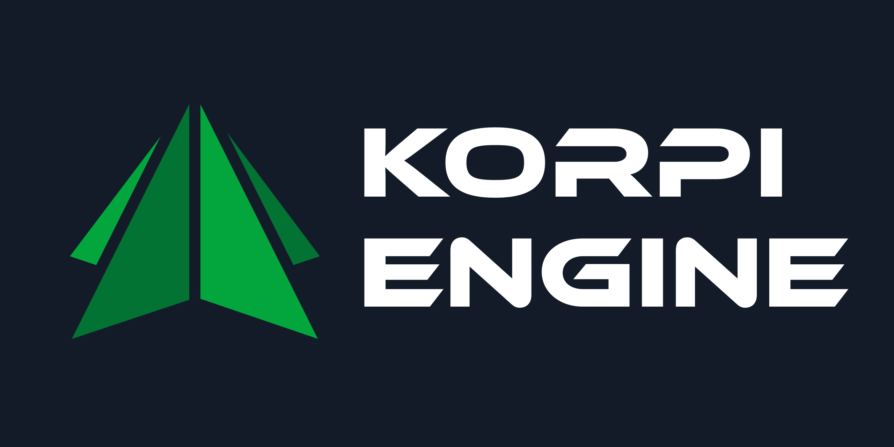

An open-source, MIT-licensed 3D game engine written in pure C# and .NET 8. The engine uses a 64-bit
(double) coordinate system on the CPU and camera-relative rendering on the GPU, to achieve large world support.

> [!WARNING]
> The engine is still under development and is not yet feature-complete!

> [!IMPORTANT]
> Only the `MAIN` branch is reserved for releases. All other branches might contain **broken** features!

- [About](#about-the-project)
- [Features & Roadmap](#features--roadmap)
- [Documentation](#documentation)
- [Getting started](#getting-started)
- [Contributing](#contributing)
- [Acknowledgments](#acknowledgments)

---

# 
About The Project

The goal of this project is to provide a viable alternative to other game engines for **programmers**,
and other people who prefer working directly with code.

Korpi Engine does **NOT** aim to:
- be just like Unity or Unreal Engine
- offer a visual scripting system
- be a one-size-fits-all solution for every game project

Korpi Engine **DOES** aim to
- stand out with its 'programmer-first' approach
- offer a clean and simple API
- adhere to the [KISS principle](https://en.m.wikipedia.org/wiki/KISS_principle)
- be a good learning tool for game/engine development
- be modular and extensible, to allow for easy integration of new features and systems.

## 
Which types of games is Korpi Engine best suited for?

- **Open-world games**: The engine is designed to handle large worlds with minimal additional programmer effort.
- **Procedural generation**: The APIs have been designed to support custom procedurally generated meshes.

An example of such a game could be a Minecraft-like voxel game, or a deep-space exploration game.

## 
Which types of games is Korpi Engine NOT well-suited for?

- **2D games**: The engine is designed for 3D games, and does not have built-in support for 2D games.
- **Mobile games**: The engine is designed for desktop platforms, and does not have built-in support for mobile platforms.
- **Highly visual games**: The engine does not have a visual scripting system, and is not designed for rapid prototyping of visual effects.
- **Games that require a large/complex asset pipeline**: While the current pipeline supports streaming and dynamic loading/unloading, features like asset compression have not yet been implemented.

## 
Why the name "Korpi"?

The name "Korpi" is Finnish and means "wilderness" or "forest". It was chosen to reflect the engine's focus on large, open-world games.

Sponza example scene @ ~5ms / frame
 Composite frame |  Albedo
:-:|:-:
 Normal |  ObjectID
 Depth |  Wireframe

---

# 
Features / Roadmap

A non-exhaustive list of currently implemented engine features. Updated every once in a while.

- Runtime
  - Scripting
    - [x] Unity-like C# scripting API
    - [x] Unity-like Coroutines
    - [x] Hybrid Entity/Component/System model
    - [x] Asset/Resource management
  - Graphics
    - [x] Graphics-API agnostic backend
      - [x] OpenGL renderer
      - [ ] DirectX renderer
      - [ ] Vulcan renderer
    - [x] Camera-relative rendering
    - [x] Point, spot & directional lights
    - [x] Post-processing pipeline
    - [x] Gizmo rendering
    - [x] Custom shader language (KSL)
  - UI
    - [x] Native Dear ImGUI support
  - Physics
    - [ ] Colliders
    - [ ] Rigidbodies
  - Audio
    - [ ] OpenAL audio backend
  - Networking
    - [x] LiteNetLib transport layer
    - [x] High-level networking API
    - [x] Server/Client architecture
  - Other
    - [x] Input system
    - [x] Scene system
    - [x] Full 64-bit coordinate system support
- Editor layer
  - [ ] Standalone editor

---

# 
Documentation

The [official documentation](https://japsuu.github.io/KorpiEngine/index.html) is hosted on GitHub Pages and is automatically updated with every commit to the `main` branch.

Quick links:
- [User Manual](https://japsuu.github.io/KorpiEngine/manual/index.html)
- [Scripting API Reference](https://japsuu.github.io/KorpiEngine/api/index.html)

---

# 
Getting Started

Check out the [Getting Started](https://japsuu.github.io/KorpiEngine/manual/getting-started.html) guide in the documentation.

It will help you get the engine up and running on your machine, and guide you through building and running the example project.

---

# 
Contributing

Contributions are welcome!

- **If you are new to contributing** to open-source projects, please read the [CONTRIBUTING.md](CONTRIBUTING.md) file for more information.
- **If you are a seasoned contributor**, you can jump straight to the [developer section](https://japsuu.github.io/KorpiEngine/developers/index.html) of the documentation.

---

# 
Acknowledgments

Portions of code or ideas are derived from the following sources:
- [OpenTK](https://github.com/opentk/opentk) for providing a managed OpenGL wrapper.
- [Prowl Engine](https://github.com/ProwlEngine/Prowl) for providing inspiration and some code snippets.
- [Unity](https://unity.com/) for providing inspiration and a reference point for the engine's design.
- [LiteNetLib](https://github.com/RevenantX/LiteNetLib) for providing a high-performance C# rUDP networking library.
- 2D game framework [Duality](https://github.com/AdamsLair/duality) for providing a reference point for the asset pipeline.
