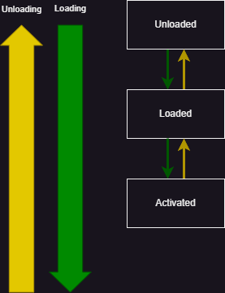
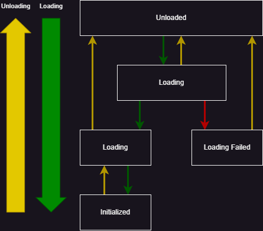


# Entity Model

> This document describes how entities, components and systems are structured in the engine.

## Abstract

The engine uses a hybrid between an Entity-Component-System (ECS) and a Game-Object-Component (Unity-like) architecture.

## Entities (from the GO-C land)

Entities are actual objects, that own components and systems. By default, they have no transform.

An entity might have a SINGLE root ``SpatialEntityComponent``. If this root component is set, the entity is considered a "spatial entity" and can have a spatial hierarchy.
If no root ``SpatialEntityComponent`` is set and the user tries to add a ``SpatialEntityComponent`` to the entity, the engine will throw an exception.

- Has a unique identifier (GUID).
- Contains a list of components.
- Contains a list of systems.
- Supports spatial hierarchies for components.
- Cannot be derived from.

### Entity Life-Cycle



Entities can be in one of the following states:
- `Unloaded`: All contained components are unloaded.
- `Loaded`: All initial components have been loaded. It's possible that there still are dynamically added components that are not yet loaded.
- `Activated`: The entity has been "turned on" in the world, and the components have been registered to both local and global systems.

Entity API:
```csharp
sealed class Entity
{
    public Guid GUID { get; }
    public string Name { get; set; }    // Mostly for debugging purposes.
    public SpatialEntityComponent? RootSpatialComponent { get; set; }    // Only one root spatial component is allowed.
    
    // Adding / removing components.
    public void AddComponent(EntityComponent component) { }
    public void RemoveComponent(EntityComponent component) { }
    public T GetComponent<T>() where T : EntityComponent { }    // Only accessible to systems.
    ...
    
    // Adding / removing systems.
    public void AddSystem(EntitySystem system) { }
    public void RemoveSystem(EntitySystem system) { }
    
    // Update, FixedUpdate, LateUpdate, Render, etc. are called by the engine.
    public void Update() { }    // Updates all systems.
    ...
}
```

## Entity Components (mix of ECS and GO-C)

Components are attached to entities. They can be thought of as black boxes that contain data and logic. There are no interdependencies between components - components cannot reference each other (see systems).

- CANNOT have an `update` method.
- CANNOT access the entity.
- CANNOT access other components.
- MOST inherit from the ``EntityComponent`` base class.
- CAN reference resources.
- CAN (optionally) contain logic, to perform operations on their OWN data (the data they own).
- CAN be added and removed at runtime.
- CAN be inherited.
- Entities CAN contain multiple instances of the same component type.
  - CAN specify if the component is a singleton (for special cases, like a transform). This just means that the engine will throw an exception if the user tries to add more than one instance of the component to the entity.

### Entity Component Life-Cycle



Since entity components can reference resources, those resources need to be loaded and initialized before the component can use them.

Example:
- A mesh-renderer component references a mesh and a texture.

Each component can be in one of the following states:
- `Unloaded`: The component has been constructed and all its properties are set, but its resources have not been loaded.
- `Loading`: The component is in the process of loading its resources.
- `Loaded`: All resources are loaded successfully.
- `Failed`: The component failed to load its resources.
- `Initialized`: See initialization below.

### Initialization

- Provides calls to allocate/deallocate internal data, which is often resource-dependent.
- Occurs automatically after once loading completes successfully.
- The initialization API is symmetric, meaning that if the component got initialized successfully, it is GUARANTEED to be deinitialized.
- Initialization is not allowed to fail; if it does, the engine will throw an exception.

Example:
- During initialization after the mesh and texture have been loaded, a mesh-renderer component allocates memory to sort the mesh vertices for rendering.
- During shutdown, the mesh-renderer component deallocates the memory.

### Base Entity Component

EntityComponent API:
```csharp
abstract class EntityComponent
{
    public Guid GUID { get; }
    public string Name { get; set; }    // Mostly for debugging purposes.

    public virtual void Load() { }
    public virtual void Unload() { }
    public virtual void Initialize() { }
    public virtual void Deinitialize() { }
}
```

### Spatial Entity Component

Spatial Entity Components are components that can be inherited by other components to provide access to the object's position, rotation, and scale. They maintain a spatial hierarchy, which allows for parent-child relationships between components.
Entities cannot be nested, but components can be.

These are the ONLY components allowed to have dependencies on other components. It would be impossible to build spatial hierarchies otherwise. The references are ONLY used to update the hierarchy.

> Note: There are still NO CROSS-ENTITY REFERENCES, all components in the hierarchy MUST belong to the same entity.

#### Transform propagation

Whenever we update the local transform, we also update the world transform:
- The world transform is recalculated based on the parent's world transform. If there is no parent, the world transform is the same as the local transform.
- The world bounds are recalculated based on the world transform.
- All child world transforms are updated recursively.

#### Bounds

Bounds can be used for culling and physics calculations. They are recalculated whenever the local or world transform changes.

Bounds are not "inclusive", but only refer to the individual component. For example, a mesh-renderer component's bounds only refer to the mesh it is rendering, not the entire entity.

```csharp
class SpatialEntityComponent : EntityComponent
{
    public Transform LocalTransform { get; set; }
    public Transform WorldTransform { get; set; }    // Calculated by the engine, cached to prevent recalculation.
    public Bounds LocalBounds { get; }
    public Bounds WorldBounds { get; }          // Calculated by the engine, cached to prevent recalculation.
    
    // References to possible parent and children components, used to propagate transformations.
    private SpatialEntityComponent? Parent { get; }
    private List<SpatialEntityComponent> Children { get; }
}
```

```csharp

Example of a mesh-renderer component, using the SpatialEntityComponent API:
```csharp
class MeshRendererComponent : SpatialEntityComponent
{
    public Mesh Mesh { get; set; }
    public Texture Texture { get; set; }

    public void Render()    // Called by a system.
    {
        // Render the mesh at the position provided by the spatial component.
    }
}
```

## Entity Systems (from the ECS land)

An Entity System is a "component manager", that tracks, updates, and transfers data between components of specific types. Systems are also the ONLY things in the entity model that have an actual functional `update` method.
Systems are attached to entities, and are conceptually very much like traditional ECS systems.

Entity Systems are NOT allowed to reference or have dependencies on other systems. They can ONLY access components of the entity they are attached to.

There are a fixed number of update stages, which are executed by the engine in a specific order:
- `Update`: At the start of the frame.
- `LateUpdate`: At the end of the frame.
- `PreFixedUpdate`: Before physics calculations.
- `FixedUpdate`: Physics calculations.
- `PostFixedUpdate`: After physics calculations.

There are "buckets" for each stage, which contain the systems that are executed in parallel. A single system can be in multiple buckets.

A single bucket is multithreaded in a worker pool, but will only transition to the next bucket when all systems in the current bucket have finished executing.
> The pool has ``PhysicalCoresCount - 1`` workers with their affinity set to prevent jumping between cores.

There are no guarantees about the order in which systems are executed within a stage.
> TODO: Research if we could specify the execution priority of a system when registering it for a stage update.

```csharp
abstract class EntitySystem
{
    public virtual void Update() { }
    public virtual void LateUpdate() { }
    public virtual void PreFixedUpdate() { }
    public virtual void FixedUpdate() { }       
    public virtual void PostFixedUpdate() { }
}
```